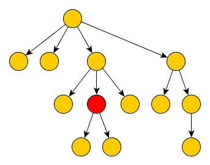
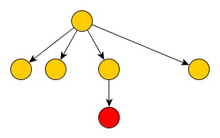
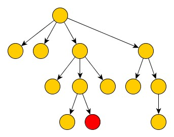
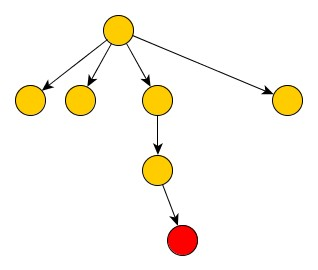

Submission comments from Srinivasan Ganesan
============================================
I used Eclipse for this. So you can import it as a project ("General-->Existing Project from Workspace").  I used Tomcat but you should be able to use pretty much any server to test. URL I used -- http://localhost:8090/NavTree/navTree/store.  Tests folder has json responses for the IDs I ran.  If you have any questions/issues, please reach out.  Thank you!

Bodybuilding.com coding-challenge
================

Thank you for taking the Bodybuilding.com Coding Challenge. We want to give you an opportunity to demonstrate your
 abilities. We will plan on using your deliverables as a point of conversation during a possible technical interview.
 Our hope is that this takes a few hours, not days. Have fun!

Using Java or Kotlin, create a REST API that returns website navigation data. The full navigation tree is included in [navigation.json](navigation.json).

Requirements:

* The API should load and parse navigation.json into memory once at application startup. It should **not** be reparsed for every request.
* Create a single API endpoint that takes a ID path parameter (/{ID}), here are some examples:
    1. /30day
    2. /30daymain
    3. /Training
* If the ID parameter is missing assume it is "root"
* Using the ID the API will find the node and return JSON for a tree that has been pruned using the following rules:

    1. The root and it's children should *always* be included
    2. The path from the selected ID (node) to the root should be included
    3. The children of other nodes should *not* be included
* If the node cannot be found the endpoint should return 404

#### Pruning Examples

Given this initial tree:

The result when querying the red node should be:

Similarly for this node:

Resulting in:

#### Submission
* Please create a branch for your work, when ready issue a pull request.
* Make sure you update this  *README* to explain how to start your API. Feel free to mention any important decisions
about the project architecture / layout that you think we should know.
* Include working unit tests
* Please note, when the interview process has concluded you will be removed from the github team, which will also delete your fork of our private repo.
* Please send an email to the recruiter and/or hiring manager you have been working with to notify them you have completed the challenge.
